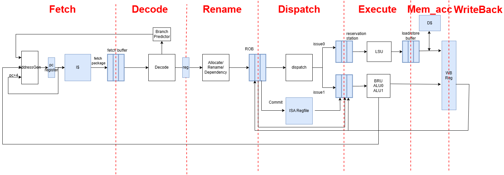

# Chisel_OoO
an out of order RISC-V processor in Chisel
# pineline

## Fetch
- 更新PC,优先级为 backend redirect > predicted PC > PC + 4
- 从`I$`中取fetch package, 存入fetch buffer

## Decode
- 从Fetch buffer 取指令，解码并生成micro-op，每周期最多取两条指令
- 如果指令为跳转指令，使用BTB预测是否跳转和跳转地址

## Rename
- 使用ROB实现寄存器重命名，将指令中的逻辑地址转化为物理地址(即在ROB中的编号)
